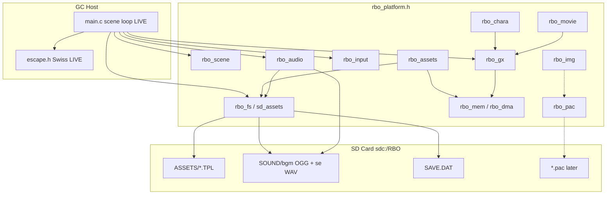

# RBO GameCube Port Skeleton

Maps PC `RBO_Ex3.exe` subsystems (Ghidra RE) onto libogc drop-ins in this proto.
Goal: clear landing pads for future work without gutting the working boot flow in `source/main.c`.

## Architecture



## PC → GC module map

| PC (RBO_Ex3) | Evidence | GC module | Status |
|---|---|---|---|
| DirectDraw7 / surfaces / flip | `FUN_00415b70` | `rbo_gx` | Stub API; blit/present live in `main.c` today |
| DirectInput8 | `FUN_00418850` | `rbo_input` | Live PAD poll via `rbo_input_*` from `main.c` |
| DirectSound8 + wav / SE.pac | `FUN_00419b30` | `rbo_audio` | **Live**: Tremor OGG BGM stream + ASND; SE WAV |
| DirectShow opening.mpg | `FUN_00453f70` / `FUN_0043e920` | `rbo_movie` | Stub: still frame / skip |
| PAC XOR `0xE3DF59AC` | `FUN_00425c90` | `rbo_pac` | API stubs + key documented; sound uses PC extract tool |
| IMG loader | `FUN_00476ed0` | `rbo_img` | Stub; runtime uses PacNyx → TPL |
| Mode FSM `DAT_0256bd30` | `FUN_00478390` | `rbo_scene` | Enum + helpers; `main.c` still owns live FSM |
| Char `.dat` + `.fob` | `FUN_00444c80` | `rbo_chara` | Stub around existing pose tables |
| CreateFile / ReadFile | `FUN_00426770` | `rbo_fs` → `sd_assets` | Thin wrapper; **live** loaders stay in `sd_assets` |
| Registry / PathCombine install | `FUN_0043b480` | — | **Omitted** (local SD only) |
| Networking | — | — | **Omitted** |

## Scene memory rules

Already practiced ad-hoc in `main.c`; helpers live in `rbo_assets` / `rbo_mem`:

1. **One UI TPL resident** (TITLE → LOBBY → STSEL), then free before next.
2. **PLAY owns STAGE01.TPL only** — do not keep UI packs pinned.
3. After `memalign(32, …)` load / before `TPL_OpenTPLFromMemory` / `GX_InitTexObj*`:  
   **`DCFlushRange(buf, size)`** (see `rbo_dma.h` / `rbo_mem`).
4. Soft reset / Swiss: always via `escape.h` (START or RESET). Blank VI before stub jump; `rbo_audio_shutdown()` first.
5. **One BGM buffer resident** (`rbo_audio_play_bgm` frees the previous track).

## SD layout (sound)

```
sdc:/RBO/SOUND/bgm/logo.ogg
sdc:/RBO/SOUND/bgm/title.ogg
sdc:/RBO/SOUND/bgm/bar.ogg
sdc:/RBO/SOUND/bgm/stsel.ogg
sdc:/RBO/SOUND/bgm/stage01.ogg
sdc:/RBO/SOUND/se/sys_se01.wav
sdc:/RBO/SOUND/se/sys_se02.wav
```

Rebuild pack: `powershell -File tools/export-sound-sd.ps1` (copies CD OGGs from `AUDIO/` by `1-01`…`1-06` prefix; SE from `SE.PAC`).

Cue map: LOGO→logo, TITLE→title, LOAD/LOBBY→bar, STSEL→stsel, PLAY→stage01; A→sys_se01, B→sys_se02.

BGM is **Tremor-decoded OGG** streamed into ASND (~512 KB PCM buffers). SE stay small mono WAV.

**sdpush note:** FatFs LFN is on (`FF_USE_LFN 1`). Retail-length names are OK.

## Stub vs live

| Live today | Stub scaffolding (compiles, no full behavior) |
|---|---|
| `main.c` boot FSM + GX walkscape | `rbo_scene` transition helpers |
| `sd_assets` SD TPL / save I/O | `rbo_fs` thin aliases |
| `escape.h` Swiss exit | `rbo_movie`, `rbo_pac`, `rbo_img` |
| Embedded anim tables (`*_anims.h`) | `rbo_chara` compositor API |
| Inline GX quads in `main.c` | `rbo_gx` present/ortho helpers |
| `rbo_audio` Tremor OGG BGM + WAV SE | — |

## Soft reset / Swiss

Documented in `escape.h`. Port policy: never rely on stock `exit()`/`__reload()` alone; use `escape_exit()` / `escape_now()`. Main calls `rbo_audio_shutdown()` before Swiss.

## Suggested next implementation order

1. ~~Move PAD edge detection into `rbo_input`~~ — done.
2. ~~Factor full-screen blit + VSync present into `rbo_gx`~~ — done (blit kept inline; FIFO-safe).
3. Drive scene swaps through `rbo_assets_load_pack()` (TITLE/LOBBY/STSEL).
4. Implement `rbo_pac` open/TOC only (XOR key in RE_FINDINGS).
5. Hook `rbo_movie` into INTRO.
6. ~~Audio~~ — done (ASND v1).

**Acceptance gate = console** (hear BGM scene changes + UI SE). Dolphin is optional only.

See also: [RE_FINDINGS.md](RE_FINDINGS.md), [SCENE_HANDLING.md](SCENE_HANDLING.md).
